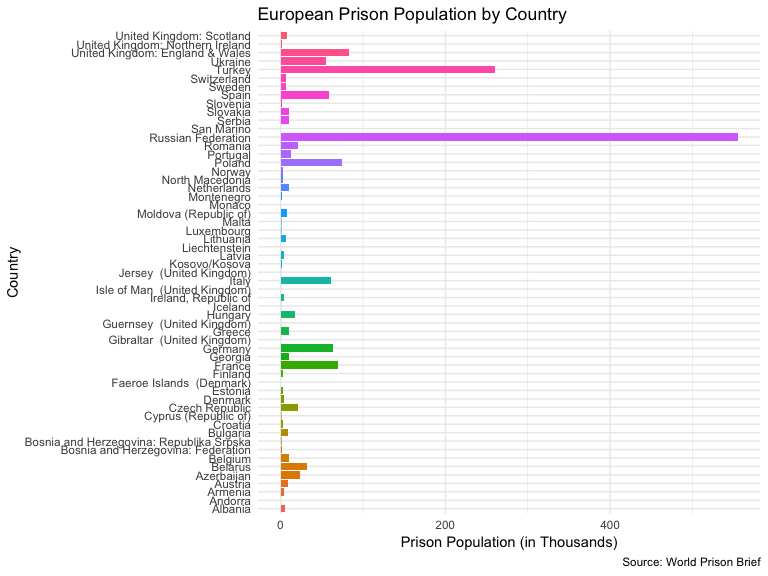

Complicated Data
================
Jess Robinson
May 20, 2019

``` r
knitr::opts_chunk$set(fig.width=8, fig.height=6, fig.path='Figs2/',
                      warning=FALSE, message=FALSE)
```

``` r
#load libraries
library(tidyverse)
library(readr)
library(here)
library(rvest)
library(knitr)

set.seed(1234)
theme_set(theme_minimal())
```

Load Data
---------

``` r
prisondata <- read_html("http://www.prisonstudies.org/highest-to-lowest/prison-population-total?field_region_taxonomy_tid=14")

tables <- html_nodes(prisondata, css = "table")

prisontable <- tables %>%
  nth(1) %>%
  html_table(header = TRUE)

kable(prisontable)
```

| Ranking | Title                                    |  Prison Population Total|
|:--------|:-----------------------------------------|------------------------:|
| NA      | United Kingdom: Scotland                 |                     8213|
| NA      | United Kingdom: Northern Ireland         |                     1438|
| NA      | Romania                                  |                    20666|
| NA      | Spain                                    |                    59218|
| NA      | Portugal                                 |                    13055|
| NA      | Malta                                    |                      635|
| NA      | Italy                                    |                    60611|
| NA      | Croatia                                  |                     3190|
| NA      | Belarus                                  |                    32500|
| NA      | Greece                                   |                    10580|
| NA      | Georgia                                  |                     9640|
| NA      | Estonia                                  |                     2567|
| NA      | Czech Republic                           |                    21623|
| NA      | Slovakia                                 |                    10372|
| NA      | United Kingdom: England & Wales          |                    82538|
| NA      | Russian Federation                       |                   554995|
| NA      | Poland                                   |                    74352|
| NA      | France                                   |                    70059|
| NA      | Netherlands                              |                    10464|
| NA      | Kosovo/Kosova                            |                     1648|
| NA      | Slovenia                                 |                     1333|
| NA      | Denmark                                  |                     3635|
| NA      | Ukraine                                  |                    54905|
| NA      | Belgium                                  |                    10073|
| NA      | Ireland, Republic of                     |                     3981|
| NA      | Germany                                  |                    63643|
| NA      | Albania                                  |                     5280|
| NA      | Montenegro                               |                     1123|
| NA      | Turkey                                   |                   260000|
| NA      | Latvia                                   |                     3765|
| NA      | Austria                                  |                     8692|
| NA      | Sweden                                   |                     5979|
| NA      | Serbia                                   |                    10807|
| NA      | San Marino                               |                        3|
| NA      | Monaco                                   |                       29|
| NA      | Moldova (Republic of)                    |                     7510|
| NA      | North Macedonia                          |                     2931|
| NA      | Azerbaijan                               |                    23320|
| NA      | Armenia                                  |                     3536|
| NA      | Andorra                                  |                       52|
| NA      | Cyprus (Republic of)                     |                      710|
| NA      | Bulgaria                                 |                     9028|
| NA      | Guernsey (United Kingdom)                |                      110|
| NA      | Jersey (United Kingdom)                  |                      128|
| NA      | Hungary                                  |                    16947|
| NA      | Norway                                   |                     3373|
| NA      | Luxembourg                               |                      650|
| NA      | Lithuania                                |                     6544|
| NA      | Isle of Man (United Kingdom)             |                      106|
| NA      | Iceland                                  |                      131|
| NA      | Faeroe Islands (Denmark)                 |                        6|
| NA      | Switzerland                              |                     6943|
| NA      | Bosnia and Herzegovina: Republika Srpska |                      863|
| NA      | Liechtenstein                            |                       10|
| NA      | Finland                                  |                     2842|
| NA      | Gibraltar (United Kingdom)               |                       56|
| NA      | Bosnia and Herzegovina: Federation       |                     1722|

Explore Data
------------

``` r
prisontable<- prisontable %>%
  mutate(prisonpop = `Prison Population Total`/1000)
```

``` r
prisontable %>%
  ggplot(mapping = aes(x = Title, y = prisonpop, fill = Title)) +
  geom_col() + 
  coord_flip() +
  theme(legend.position="none") + 
  labs(title = "European Prison Population by Country",
       x = "Country",
       y = "Prison Population (in Thousands)",
       caption = "Source: World Prison Brief"
  )
```



The above chart shows the prison population in European Countries from *World Prison Brief*.
